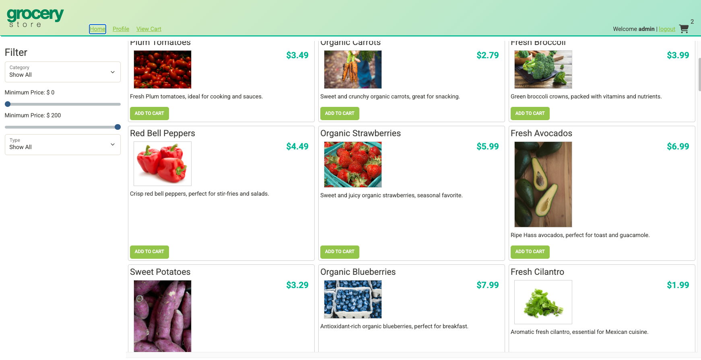
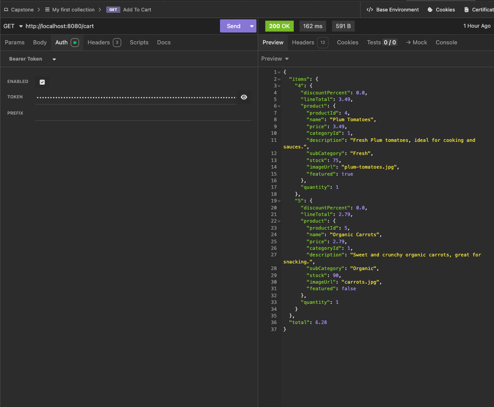
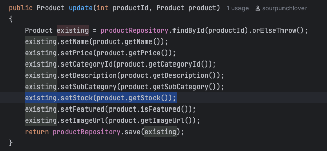

# Ecommerce Grocery Store API

A Spring Boot REST API for an online grocery store. This was my final capstone project for Year Up United's Application Development Training program. The project involved fixing bugs in existing starter code and building out new features for the backend API.

The frontend was provided as a starter. My job was to work as the backend developer, find and fix the bugs, implement new endpoints, and make sure everything connected correctly to the frontend.

## Tech Stack

- Java and Spring Boot
- Spring Data JPA
- MySQL and MySQL Workbench
- Spring Security with JWT authentication
- Maven
- Insomnia for API testing
- IntelliJ IDEA

## Features

### Bug Fixes

- **Bug 1 - Product Search:** Only featured products were being returned by the search endpoint. There was an unconditional filter in the search method that excluded any product where featured was false, so only 24 out of 62 products came back. Removing that filter fixed it.

- **Bug 2 - Stock Not Saving:** When updating a product, the stock field appeared to save successfully but the value in the database never actually changed. The update() method in ProductService was missing the setStock() call. Adding that one line fixed it.

### New Features

- **Categories:** Full CRUD for product categories. Only admins can create, update, or delete categories.
- **Shopping Cart:** Users can add products to their cart, view cart contents with product details and totals, and clear their cart. The cart saves between sessions.
- **User Profile:** Users can view and update their profile information.

## Application Screens

### Grocery Store Frontend


### Shopping Cart API Response


### Interesting Piece of Code


## Interesting Piece of Code

```java
public Product update(int productId, Product product)
{
    Product existing = productRepository.findById(productId).orElseThrow();
    existing.setName(product.getName());
    existing.setPrice(product.getPrice());
    existing.setCategoryId(product.getCategoryId());
    existing.setDescription(product.getDescription());
    existing.setSubCategory(product.getSubCategory());
    existing.setStock(product.getStock());  // this line was missing (Bug 2)
    existing.setFeatured(product.isFeatured());
    existing.setImageUrl(product.getImageUrl());
    return productRepository.save(existing);
}
```

This is the update() method in ProductService. It pulls the existing product from the database, copies the new values onto it, and saves it back. The original code had every field covered except stock. So when someone updated a product the request would return 200 OK but the stock value in the database never changed. Adding existing.setStock(product.getStock()) was the fix.

## Setup Instructions

### Prerequisites
- Java 17+
- MySQL
- Maven

### Database Setup
1. Open MySQL Workbench
2. Run the grocery-store.sql script from the database folder
3. This creates the grocerystore database with all tables and seed data

### Application Setup
1. Clone the repository:
   ```
   git clone https://github.com/sourpunchlover/ecommerce-grocery-store.git
   ```
2. Open the project in IntelliJ IDEA
3. Update src/main/resources/application.properties with your MySQL credentials:
   ```
   spring.datasource.url=jdbc:mysql://localhost:3306/grocerystore
   spring.datasource.username=your_username
   spring.datasource.password=your_password
   ```
4. Run ECommerceApplication.java
5. API runs on http://localhost:8080

### Demo Users
| Username | Password | Role  |
|----------|----------|-------|
| user     | password | USER  |
| admin    | password | ADMIN |
| george   | password | USER  |

## API Endpoints

| Method | URL | Description | Auth Required |
|--------|-----|-------------|---------------|
| GET | /categories | Get all categories | None |
| GET | /categories/{id} | Get category by id | None |
| GET | /categories/{id}/products | Get products by category | None |
| POST | /categories | Add a category | Admin |
| PUT | /categories/{id} | Update a category | Admin |
| DELETE | /categories/{id} | Delete a category | Admin |
| GET | /products | Search and filter products | None |
| GET | /cart | Get current user's cart | User |
| POST | /cart/products/{id} | Add product to cart | User |
| DELETE | /cart | Clear cart | User |
| GET | /profile | Get current user's profile | User |
| PUT | /profile | Update current user's profile | User |

## Author

Syd - Year Up United Application Development Training, January 2027
